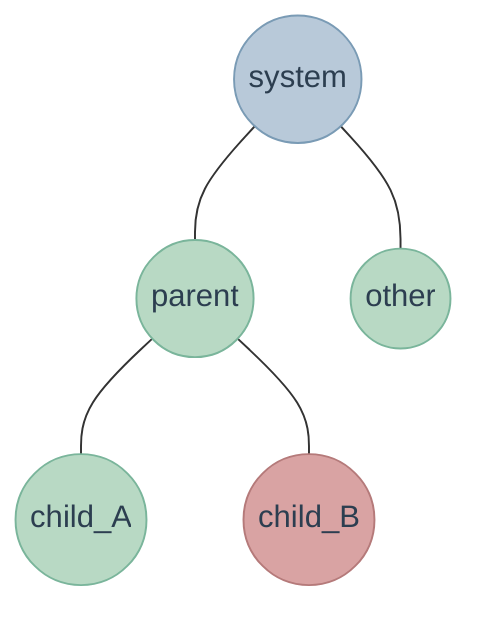
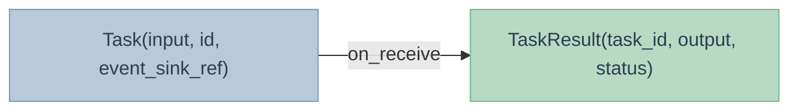
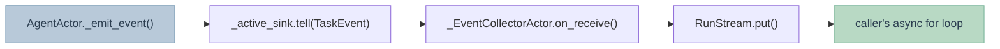
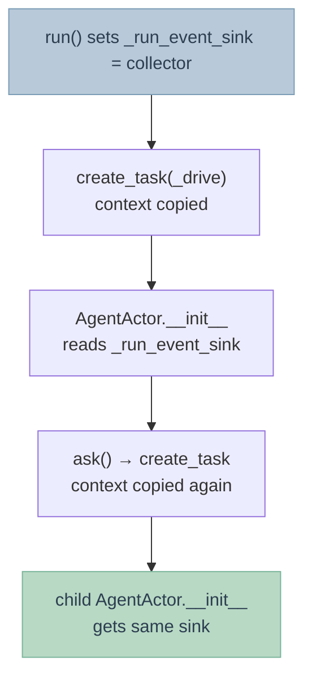

# Design

Architecture overview and key design decisions for `everything-is-an-actor`.

---

## Architecture

The framework has five layers with a strict downward dependency direction:

```mermaid
block-beta
    columns 1
    block:int["Integrations — LangChain adapter"]
    end
    block:moa["MOA — moa_layer · moa_tree · MoASystem · LayerOutput"]
    end
    block:flow["Flow ADT — Flow · combinators · interpreter · serialize · viz"]
    end
    block:agent["Agent layer — Task · AgentActor · AgentSystem · streaming"]
    end
    block:core["Core layer — Actor · ActorRef · ActorSystem · Mailbox"]
    end

    style int fill:#b8c9d9,stroke:#7a9bb5,color:#2c3e50
    style moa fill:#c4b8d9,stroke:#9b7ab5,color:#2c3e50
    style flow fill:#d9c4b8,stroke:#b59b7a,color:#2c3e50
    style agent fill:#b8d9c4,stroke:#7ab59b,color:#2c3e50
    style core fill:#d9d4b8,stroke:#b5b07a,color:#2c3e50
```

Dependency direction: `integrations/ → flow/ → agents/ → core/` (and `moa/ → flow/ → agents/ → core/`).

- **Core** — general-purpose actor runtime, usable independently
- **Agents** — AI-specific abstractions (Task protocol, streaming events) built on core
- **Flow** — composable orchestration ADT with categorical combinators, interpreted over agents
- **MOA** — Mixture-of-Agents pattern library built on Flow primitives
- **Integrations** — adapters for external frameworks (LangChain)

---

## Core layer

### Actor cell

Each actor lives in a `_ActorCell` that the user never sees directly. The cell owns:

- **mailbox** — `asyncio.Queue` (or pluggable backend)
- **task** — a single `asyncio.Task` running the actor loop
- **children** — `dict[name, _ActorCell]`
- **ref** — the public `ActorRef` handle

The actor loop processes one message at a time. There is no shared state between actors — all communication goes through the mailbox.

### Message passing

Two primitives:

| | `tell` | `ask` |
|--|--|--|
| Blocks caller | No | Yes |
| Returns | None | Actor's return value |
| Mechanism | Enqueue envelope | Correlation ID + Future in ReplyRegistry |

`ask` does not put a `Future` in the mailbox. Instead it registers a correlation ID in `ReplyRegistry` (on the system), enqueues the message, and awaits the future. When the actor replies, the cell resolves the future directly. This makes `ask` work across any mailbox backend including Redis.

### Supervision tree

When a child actor raises, its parent's `supervisor_strategy()` is called with the exception. The default is `OneForOneStrategy` (restart only the failing child, up to 3 times per 60 s).



With `OneForOneStrategy`: only `child_B` is restarted. With `AllForOneStrategy`: both `child_A` and `child_B` are restarted.

Directives: `restart` → `resume` → `stop` → `escalate` (propagates to grandparent).

### ActorRef

`ActorRef` is an immutable handle. It holds a reference to `_ActorCell` but exposes no cell internals to users. Equality is identity (`is`), not value. This matches the Erlang PID model.

`join()` waits for the actor task to complete using `asyncio.shield` — if the caller is cancelled, the wait is abandoned but the actor continues its own shutdown. Only `CancelledError` is suppressed; other task failures propagate to make teardown problems visible.

### Stop Policy ADT

Actors are persistent by default (`StopMode.NEVER`). The `stop_policy()` method returns a policy that controls automatic lifecycle management:

| Policy | Behavior |
|--------|----------|
| `StopMode.NEVER` | Never auto-stop (default) |
| `StopMode.ONE_TIME` | Stop after processing one message |
| `AfterMessage(msg)` | Stop after receiving the specific message |
| `AfterIdle(seconds)` | Stop after being idle for N seconds |

The policy is checked after each message is processed. `tell()` (spawning temporary actors) requires a non-NEVER policy to prevent actor leaks.

### Virtual Actor Registry

Virtual actors exist conceptually forever but only consume resources when active. The `VirtualActorRegistry` manages their lifecycle.

Two kinds of actor coexist:

| Type | Lifecycle | Recovery on restart | Use case |
|------|-----------|-------------------|----------|
| **Declarative** | Code-defined, lives with the process | Code recreates on startup | Infrastructure (Gateway, Router, RateLimiter) |
| **Virtual** | On-demand activation, idle deactivation | No recovery — messages trigger reactivation | Business entities (ChatSession, AgentTask) |

```python
system = ActorSystem("app")

# Declarative: always running
gateway = await system.spawn(Gateway, "gateway")

# Virtual: only activated when needed
registry = VirtualActorRegistry(system)
reply = await registry.ask(ChatAgent, "session_123", "hello")
```

Key design decisions (Orleans model):

- **Flat structure**: virtual actors have no parent-child relationships. They address each other by ID through the registry, not through `context.spawn()`.
- **No dynamic topology recovery**: process restart does not rebuild previous actor trees. Virtual actors reactivate on demand; declarative actors are recreated by code.
- **State is the business's responsibility**: the runtime guarantees `on_started` (activation) and `on_stopped` (deactivation) are called. What gets loaded/saved in those hooks is up to the business.
- **Supervision is per-activation only**: `on_receive` exception → supervision strategy decides restart/stop. This does not persist across process restarts.

`context.spawn()` is for **ephemeral child actors** (run and discard, no cross-restart recovery). Long-lived actors go through `VirtualActorRegistry`.

**Registry store is pluggable**: default is in-memory. Replace with a persistent backend (Redis, DB) for:
- Querying "which virtual actors existed before" after restart (`known_ids()`)
- Push scenarios: scheduled tasks, broadcasts that need to know all actor IDs

```python
class RedisRegistryStore(RegistryStore):
    async def put(self, key): await redis.sadd("actors", key)
    async def delete(self, key): await redis.srem("actors", key)
    async def list_all(self): return list(await redis.smembers("actors"))

registry = VirtualActorRegistry(system, store=RedisRegistryStore())
```

### Lifecycle guarantees

The runtime guarantees:
- **on_started**: always called before the actor processes any message. If it fails, the actor is not created.
- **on_stopped**: always called when the actor stops (idle timeout, manual deactivation, system shutdown). Protected by `asyncio.shield` — external cancellation cannot skip it. Has a timeout (10s) to prevent deadlocks. On `CancelledError`, retried once.

The only case where `on_stopped` does not run: process killed by OS (kill -9, OOM). This is an OS-level limitation no user-space code can handle. For critical state, business code should save after each message, not rely solely on `on_stopped`.

### Free Monad API

For composable actor workflows, the framework provides `Free[ActorF, A]` monad:

```python
from everything_is_an_actor import ActorSystem, ActorRef

# Build a workflow using ref.free_xxx()
def workflow(ref: ActorRef):
    return (
        ref.free_ask("hello")
        .flatMap(lambda r: ref.free_tell(r.upper()))
        .flatMap(lambda _: ref.free_stop())
    )

# Execute against the live system
result = await system.run_free(workflow(worker_ref))
```

The Free monad separates workflow description from interpretation, enabling testable mock interpreters.

---

## Agent layer

### The Task protocol

Every message to an `AgentActor` is a `Task`. This is the contract between orchestrators and workers:



The `id` field is a uuid hex generated at construction time. It becomes the `task_id` in all emitted events, enabling event stream consumers to correlate events across a distributed call tree.

### AgentActor

`AgentActor` wraps the actor primitive with the Task protocol. The user overrides `execute()` and never touches `on_receive()`. The framework:

1. Emits `task_started`
2. Calls `execute(input)`
3. If `execute` returns a coroutine: awaits it, emits `task_completed`
4. If `execute` returns an async generator: drives it with `async for`, emits `task_chunk` per yield, then `task_completed`
5. On exception: emits `task_failed`, re-raises for supervision

Detection of async generator vs coroutine uses `inspect.isasyncgen()` after calling `self.execute(input)` — the call itself is synchronous; it only produces the generator or coroutine object.

### Progressive API

Five levels of increasing power — pick the lowest level you need:

| Level | Pattern | Use when |
|-------|---------|----------|
| 1 | Plain class with `execute()` | Stateless workers |
| 2 | + `on_started` / `on_stopped` | Resource management |
| 3 | + `__actor__ = ActorConfig(...)` | Tune mailbox/restarts without subclassing |
| 4 | Subclass `AgentActor` | Full power: typing, `emit_progress`, supervision |
| 5 | Subclass `Actor` | Infrastructure actors (routers, caches, rate limiters) |

---

## Streaming architecture

### Problem

AI agents produce intermediate output (LLM tokens, progress updates, child agent events). Callers need this data in real time — not just the final `TaskResult`.

### Solution: event sink routing

Every `TaskEvent` is routed to a **sink** — an `_EventCollectorActor` that feeds a `RunStream`. The routing path:



### Sink lifecycle

There are two ways to attach a sink:

**`AgentSystem.run()`** — sets `_run_event_sink` ContextVar before spawning the root agent. All `AgentActor` instances created within that asyncio task context automatically inherit the sink via `asyncio.create_task()` context copy.

**`ActorRef.ask_stream()`** — injects `event_sink_ref` into the `Task` itself. `AgentActor.on_receive()` picks it up as `message.event_sink_ref` and sets it as `_active_sink` for the duration of that call. It also sets the `_run_event_sink` ContextVar so child actors spawned via `ask()` during `execute()` inherit the same sink.

The per-ask sink (`event_sink_ref`) takes precedence over the run-level sink (`_run_event_sink`). This lets `ask_stream()` work on existing agents that were already spawned inside a `run()` session.

### ContextVar propagation

`asyncio.create_task()` copies the current `contextvars.Context` into the new task. This is the mechanism by which the event sink propagates to child actors without any explicit wiring:



### RunStream

`RunStream` is a thin wrapper over `asyncio.Queue[TaskEvent | None]`. The sentinel `None` signals end-of-stream. It is closed by the `_drive` background task when the root agent finishes or fails.

### _EventCollectorActor

A minimal `Actor` that receives `TaskEvent` messages and puts them on the `RunStream`. One instance per run / per `ask_stream` call.

Instantiated via `make_collector_cls(stream)` — a factory that returns a subclass with the stream captured in `__init__`. This satisfies the framework's no-arg constructor contract without post-spawn private attribute injection.

---

## Orchestration

### ask()

Spawn a child, send one message, await result, stop child. The finally block guarantees cleanup even if the caller raises or is cancelled:

```python
ref = await self.spawn(target, name)
try:
    return await ref.ask(message, timeout=timeout)
finally:
    ref.stop()
    if cancelling() > 0:
        ref.interrupt()
    await ref.join()
```

`interrupt()` is called when the wrapper task is itself being cancelled (e.g. as a sibling in `sequence()`). It cancels the actor's asyncio task directly, so `join()` returns immediately instead of waiting for the actor's current sleep/IO to finish.

### sequence()

Fan-out to N agents using `asyncio.wait(FIRST_EXCEPTION)`. When the first task fails, siblings are cancelled immediately — their `ask()` finally blocks still run on `CancelledError`, so no ephemeral children are left running.

The key decision: fail-fast (stop expensive side effects ASAP) over guaranteed synchronous cleanup (wait for all tasks). Cleanup is still guaranteed — cancelled children process the `_Stop` sentinel from `ref.stop()` and shut down cleanly.

### stream()

Streaming counterpart of `ask()`. An async generator that:

1. Spawns ephemeral child (if class target)
2. Iterates `ref.ask_stream(message)` and yields each `StreamItem`
3. Stops child in `finally` — even if caller breaks early

This enables transparent chunk forwarding in orchestrators:

```python
async def execute(self, input: str):
    async for item in self.context.stream(LLMAgent, Task(input=input)):
        match item:
            case StreamEvent(event=e) if e.type == "task_chunk":
                yield e.data   # becomes task_chunk for the orchestrator's caller
```

---

## Span linking

Every `TaskEvent` carries:

- `task_id` — the current task's ID
- `parent_task_id` — the calling agent's `task_id` (None for root)
- `parent_agent_path` — the calling agent's actor path (None for root)

`parent_task_id` is read from `_current_task_id_var` ContextVar at the start of `on_receive()`, before the current task_id is set. Child actors spawned via `ask()` inherit the parent's task_id through the context copy, so the full call tree is reconstructable from a flat event stream — equivalent to OpenTelemetry parent span injection.

---

## Key tradeoffs

### Sequential actor processing

Actors process one message at a time. This eliminates data races on actor state without locks. The tradeoff: a slow `execute()` blocks subsequent messages to the same actor. Solution: use ephemeral actors via `ask()` — each call gets a fresh actor with no queuing contention.

### ask_stream uses a sidecar collector actor

`ask_stream` spawns a separate `_EventCollectorActor` as a peer (not a child) of the target actor. The alternative — having the target actor send events directly to the caller — would require passing a callback or queue into the actor, coupling the actor to the streaming API. The sidecar keeps the actor oblivious: it just calls `_emit_event()`, which routes to whatever sink is attached.

### Async generator detection at call time

`inspect.isasyncgen(self.execute(input))` is called after invoking `execute()`. The function is called once; the result determines the execution path. This means the same `execute()` method cannot switch modes per call, which is intentional — execute() should be consistently either a coroutine or an async generator.

### No streaming in lifecycle hooks

`on_started`, `on_stopped`, `on_restart` are plain coroutines — no `yield`. Streaming only makes sense in response to a `Task` (there's a caller to stream to). Lifecycle hooks have no caller context.
