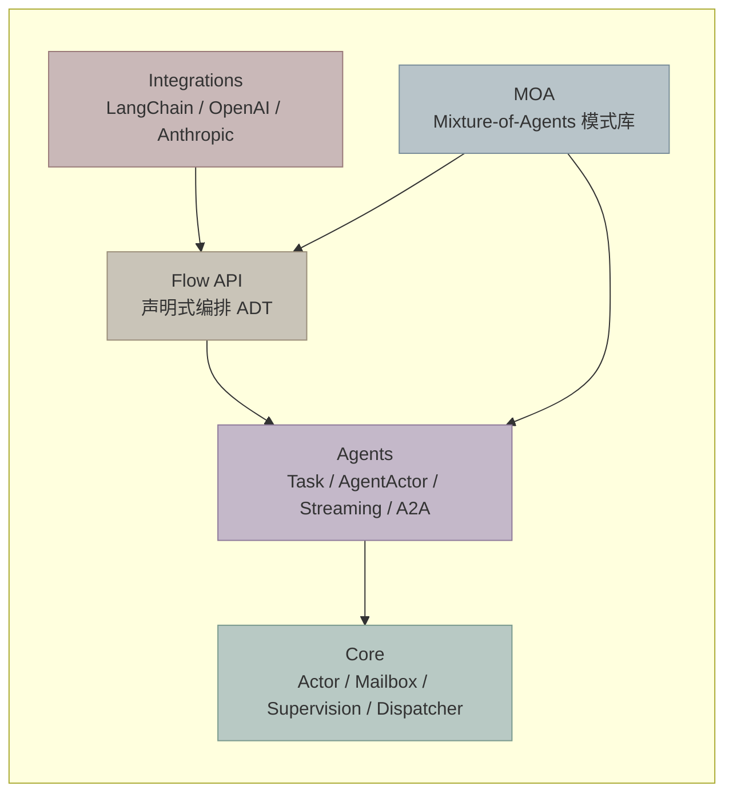

# everything-is-an-actor: Python Agent 编排框架

## 一句话

基于 Actor Model 的 Python AI Agent 编排框架。用 Erlang/Akka 的思路解决多 Agent 系统的并发、容错和组合问题。

## 为什么需要这个框架

多 Agent 系统的核心问题不是 AI，是**并发编排**：

- 一个 Lead Agent 分发任务给多个 Worker，怎么管理并行执行？
- 某个 Worker 失败了，是整体重试还是降级？
- Agent 之间怎么通信，怎么追踪状态？
- 编排逻辑怎么复用、可视化、序列化？

这些问题在分布式系统里早就解决了——Erlang 的 Actor Model、Akka 的 Supervision Tree。我们把这套思路搬到 Python asyncio，专门针对 AI Agent 场景。

## 架构五层



依赖方向：上层依赖下层，**下层不感知上层**。Core 是通用 Actor 运行时，完全不知道 AI 的存在。

## 核心特性

### 1. Progressive API — 渐进式入门

不需要一上来就学完整个框架。从最简单的写法开始，按需升级：

**Level 1 — 一个函数**

```python
class Echo(AgentActor[str, str]):
    async def execute(self, input: str) -> str:
        return f"echo: {input}"
```

**Level 2 — 加 Streaming**

```python
class Summarizer(AgentActor[str, str]):
    async def execute(self, input: str) -> str:
        async for chunk in llm.stream(input):
            await self.emit_progress(chunk)  # 实时推送
        return final_result
```

**Level 3 — 加编排**

```python
class Orchestrator(AgentActor[str, str]):
    async def execute(self, input: str) -> str:
        results = await self.context.sequence([
            (Researcher, Task(input=input)),
            (Analyst, Task(input=input)),
        ])
        return merge(results)
```

**Level 4 — 声明式 Flow**

```python
pipeline = (
    agent(Researcher)
    .zip(agent(Analyst))
    .map(merge)
    .flat_map(agent(Writer))
    .recover_with(agent(Fallback))
)
result = await system.run_flow(pipeline, user_query)
```

每一级都不需要重写前一级的代码。

### 2. Flow API — 对标 LangGraph 的声明式编排

这是框架的核心差异点。先看对比：

| 维度 | LangGraph | Flow API |
|------|-----------|----------|
| 编排模型 | 有向图 + 状态机 | 代数数据类型（ADT） |
| 组合方式 | 命令式 add_node/add_edge | 函数式 map/flat_map/zip/race |
| 类型安全 | 运行时 TypedDict | 编译期 Flow[I, O] 端到端 |
| 并发原语 | 需要手写 fan-out/fan-in | 内置 zip（并行）、race（竞争）、at_least（法定人数） |
| 错误处理 | 需要 conditional edge | 内置 recover / fallback_to（Supervision） |
| 序列化 | 自定义 checkpoint | 原生 to_dict / from_dict |
| 可视化 | 需要额外工具 | 内置 visualize() 生成 Mermaid |
| 执行 | 图编译后直接执行 | ADT 是数据，Interpreter 赋予语义 |

**Flow 是数据，不是执行。** 你写的每一行 `.map()` `.flat_map()` 都在构建语法树，直到 `run_flow()` 才真正执行。这意味着：

- 可以在不执行的情况下序列化、传输、可视化
- 可以替换 Interpreter 改变执行语义（测试、调试、分布式）
- 组合子满足结合律，链式组合不会出意外

**Flow 的组合子（范畴论视角）：**

| 组合子 | 范畴论 | 含义 |
|--------|--------|------|
| map | Functor | 对输出做纯变换 |
| flat_map | Monad (Kleisli) | 串行：前一个的输出喂给后一个 |
| zip | Tensor Product | 并行：两个同时跑，收集双方结果 |
| race | Coproduct | 竞争：多个同时跑，取最快的 |
| at_least(n) | Validated | 法定人数：至少 n 个成功就行 |
| branch | Coproduct Dispatch | 按类型路由 |
| recover | MonadError | 异常恢复 |
| loop | tailRecM / Trace | 迭代直到满足条件 |

**示例 — 研究 + 分析 + 撰写 pipeline：**

```python
from everything_is_an_actor.flow import agent, race, at_least

pipeline = (
    at_least(2,                          # 至少 2 个搜索引擎返回
        agent(GoogleSearch),
        agent(BingSearch),
        agent(DuckDuckGo),
    )
    .flat_map(agent(Analyzer))           # 分析搜索结果
    .flat_map(agent(Writer))             # 撰写报告
    .recover(lambda e: f"Failed: {e}")   # 兜底
)
```

### 3. Supervision — 让失败成为常态

借鉴 Erlang 的 "let-it-crash" 哲学。Agent 不需要自己处理所有异常——让它崩，由 Supervisor 决定怎么办：

| 策略 | 含义 |
|------|------|
| Resume | 忽略错误，继续处理下一条消息 |
| Restart | 重启 Actor（重新初始化状态） |
| Stop | 停止这个 Actor |
| Escalate | 往上层报，让父级 Supervisor 决定 |

```python
class MyOrchestrator(AgentActor[str, str]):
    def supervisor_strategy(self):
        return OneForOneStrategy(
            max_restarts=3,
            within_seconds=60,
            decide=lambda exc: Directive.RESTART
        )
```

Agent 只管业务逻辑，容错交给框架。

### 4. MOA — Mixture-of-Agents 多路投票

论文 [Mixture-of-Agents](https://arxiv.org/abs/2406.04692) 的工程落地。核心思路：多个 Agent 并行提议，聚合器投票合并，层层递进提升质量。

MOA 建立在 Flow 之上，两个函数搞定：

```python
from everything_is_an_actor.moa import moa_layer, moa_tree

# 单层：3 个 proposer 并行，至少 2 个成功，aggregator 合并
layer = moa_layer(
    proposers=[GPT4Agent, ClaudeAgent, GeminiAgent],
    aggregator=MergeAgent,
    min_success=2,
)

# 多层：layer1 的输出喂给 layer2，逐层精炼
pipeline = moa_tree([layer1, layer2, layer3])
result = await system.run_flow(pipeline, user_query)
```

**Directive 传递**：aggregator 可以返回 `LayerOutput(result, directive)`，directive 会注入到下一层 proposer 的输入里。上层告诉下层"关注什么"——单向指导，不是双向对话。

内部展开就是 Flow 组合子：

```
pure(inject_directive)
  → at_least(min_success, proposer1, proposer2, ...)
  → agent(aggregator)
  → map(extract_directive)
```

没有 MOA 专属的运行时——它就是 Flow 的一种用法。

### 5. A2A — Agent 发现与多轮对话

受 Google A2A 协议启发，支持 Agent 能力声明和发现：

```python
class TranslateAgent(AgentActor[str, str]):
    __card__ = AgentCard(
        name="translator",
        skills=("translation",),
        description="Translates documents between languages",
    )
```

发现机制是 predicate-based，选择策略完全由调用方决定：

```python
# 按技能精确匹配
ref, card = system.discover_one(
    lambda agents: next(
        ((r, c) for r, c in agents if "translation" in c.skills), None
    )
)

# 让 LLM 根据描述选择
ref, card = system.discover_one(lambda agents: llm.select(agents))
```

多轮对话不需要特殊机制——Actor 本身就是状态机，每次 `execute()` 处理一条消息，用 `self` 记状态：

```python
class ChatAgent(AgentActor[str, str]):
    _history: list[str] = []

    async def execute(self, input: str) -> str:
        self._history.append(input)
        if needs_clarification(input):
            return "Could you be more specific?"  # 多轮
        return generate_response(self._history)    # 最终回答
```

### 6. Virtual Actors — Orleans 风格按需激活

Agent 不需要常驻内存。Virtual Actor 在收到消息时自动激活，空闲超时后自动回收：

```python
registry = VirtualActorRegistry(system)

# 第一条消息自动激活 ChatAgent
reply = await registry.ask(ChatAgent, "session_123", "hello")

# 5 分钟无消息，自动释放资源
```

适合长会话场景——每个 session 对应一个 Virtual Actor，用完即走。

### 7. ComposableFuture — 函数式异步原语

替代 Python 原生的 asyncio.Task，支持链式组合：

```python
future = (
    context.ask(AgentA, task_a)
    .map(transform)
    .flat_map(lambda r: context.ask(AgentB, Task(input=r)))
    .recover(lambda e: default_value)
    .with_timeout(30.0)
)
result = await future
```

## 与主流框架对比

| 维度 | everything-is-an-actor | LangGraph | CrewAI | AutoGen |
|------|----------------------|-----------|--------|---------|
| 编排模型 | Actor + Flow ADT | 有向图 | 角色+任务 | 对话 |
| 并发 | 原生（Actor 天然并行） | 手动 fan-out | 顺序为主 | 有限 |
| 容错 | Supervision Tree | 无 | 无 | 无 |
| 类型安全 | Flow[I,O] 端到端 | TypedDict | 无 | 无 |
| 序列化 | 原生 to_dict/from_dict | Checkpoint | 无 | 无 |
| Agent 发现 | AgentCard + discover | 无 | 无 | 无 |
| Streaming | 内置（ask_stream） | 回调 | 无 | 无 |
| 多轮 | Actor 状态机 | 图循环 | 无 | 原生 |

## 核心理念

> **Everything is an Actor。**

每个 Agent 是一个 Actor。Actor 之间只通过消息通信，没有共享状态。这不是框架的限制，而是并发正确性的保证。

在这个基础上：

- **Flow** 是 Actor 之上的声明式编排层——用范畴论的组合子表达工作流
- **MOA** 是 Flow 之上的模式库——用 at_least + aggregator 实现多路投票
- **A2A** 是 Agent 之上的发现层——让 Agent 声明能力，让系统按需匹配

层层递进，各司其职。
