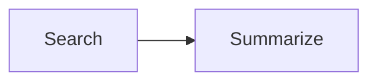

# Flow API

Composable agent orchestration with categorical concurrency primitives.

`Flow[I, O]` is an ADT (algebraic data type) — a syntax tree that describes workflows as data, not execution. Build a Flow with combinators, then interpret it against an actor runtime.

---

## Why Flow?

The agent layer's orchestration primitives (`ask`, `sequence`, `race`, `zip`) are imperative — you write `await` calls and wire them together manually. Flow lifts orchestration into a **declarative DSL**:

```python
from everything_is_an_actor.flow import agent, pure, race, at_least

pipeline = (
    agent(Researcher)
    .zip(agent(Analyst))
    .map(merge)
    .flat_map(agent(Writer))
    .recover_with(agent(Fallback))
)
```

This is data. No execution happens until you call `system.run_flow(pipeline, input)`. Benefits:

- **Serializable** — persist workflows, transfer across process boundaries
- **Visualizable** — auto-generate Mermaid diagrams
- **Testable** — inspect the ADT structure without running agents
- **Composable** — all combinators are associative, compose without surprise

---

## Quick Start

```python
import asyncio
from everything_is_an_actor import ActorSystem
from everything_is_an_actor.agents import AgentSystem, AgentActor
from everything_is_an_actor.flow import agent, pure

class Upper(AgentActor[str, str]):
    async def execute(self, input: str) -> str:
        return input.upper()

class Exclaim(AgentActor[str, str]):
    async def execute(self, input: str) -> str:
        return input + "!"

pipeline = agent(Upper).flat_map(agent(Exclaim))

async def main():
    system = AgentSystem(ActorSystem())
    result = await system.run_flow(pipeline, "hello")
    print(result)  # "HELLO!"
    await system.shutdown()

asyncio.run(main())
```

---

## Flow ADT Variants

Every combinator produces a frozen dataclass node. The full ADT:

### Leaf Nodes

| Variant | Constructor | Description |
|---------|-------------|-------------|
| `_Agent` | `agent(cls, timeout=30.0)` | Wraps an `AgentActor` class |
| `_Pure` | `pure(f)` | Wraps a pure function `f: I -> O` |

### Sequential Composition

| Variant | Method / Constructor | Description |
|---------|---------------------|-------------|
| `_FlatMap` | `.flat_map(next_flow)` | Monad bind — output of self feeds into next |
| `_Map` | `.map(f)` | Functor — post-compose with a pure function |

### Parallel Composition

| Variant | Method / Constructor | Description |
|---------|---------------------|-------------|
| `_Zip` | `.zip(other)` | Tensor product — two flows in parallel, result is tuple |
| `_ZipAll` | `zip_all(*flows)` | N-way parallel, results collected as list |
| `_Race` | `race(*flows)` | First to complete wins, others cancelled |

### Branching

| Variant | Method | Description |
|---------|--------|-------------|
| `_Branch` | `.branch({type: flow})` | Route by `isinstance` dispatch on output type |
| `_BranchOn` | `.branch_on(pred, then, otherwise)` | Binary predicate branch |

### Error Recovery

| Variant | Method | Description |
|---------|--------|-------------|
| `_Recover` | `.recover(handler)` | Catch exception, return fallback value |
| `_RecoverWith` | `.recover_with(handler_flow)` | Catch exception, run another Flow |
| `_FallbackTo` | `.fallback_to(other)` | If self fails, try other with original input |

### Looping

| Variant | Constructor | Description |
|---------|-------------|-------------|
| `_Loop` | `loop(body, max_iter=10)` | `tailRecM` — iterate until `Done`, safety bound |
| `_LoopWithState` | `loop_with_state(body, init_state, max_iter=10)` | Loop with explicit feedback state |

### Utilities

| Variant | Method | Description |
|---------|--------|-------------|
| `_AndThen` | `.and_then(callback)` | Tap — side-effect, value passes through |
| `_Filter` | `.filter(predicate)` | Guard — raise `FlowFilterError` if predicate fails |
| `_DivertTo` | `.divert_to(side, when)` | Fire-and-forget to side flow on predicate match |

---

## Combinators in Detail

### `flat_map` — Sequential Composition

```python
pipeline = agent(Search).flat_map(agent(Summarize))
# Search runs first, output feeds as Summarize's input
```

This is Kleisli composition. Associative: `a.flat_map(b).flat_map(c) ≡ a.flat_map(b.flat_map(c))`.

### `zip` — Parallel Composition

```python
pipeline = agent(Search).zip(agent(Analyze))
# Both run concurrently, result is (search_output, analyze_output)
# Input must be a tuple: (search_input, analyze_input)
```

### `zip_all` — N-way Parallel

```python
from everything_is_an_actor.flow import zip_all

pipeline = zip_all(agent(A), agent(B), agent(C))
# Input: (a_input, b_input, c_input)
# Output: [a_output, b_output, c_output]
```

### `race` — Competitive Parallelism

```python
from everything_is_an_actor.flow import race

pipeline = race(agent(Fast), agent(Slow))
# First to complete wins, loser cancelled
```

### `at_least` — Quorum Parallelism

```python
from everything_is_an_actor.flow import at_least
from everything_is_an_actor.flow.quorum import QuorumResult

pipeline = at_least(2, agent(A), agent(B), agent(C))
# All run concurrently with same input
# Succeeds if >= 2 succeed
# Returns QuorumResult(succeeded=(...), failed=(...))
```

Domain exceptions are collected into `QuorumResult.failed`. System exceptions (`MemoryError`) propagate immediately.

### `branch` — Type-Based Routing

```python
pipeline = agent(Classifier).branch({
    Positive: agent(CelebrateAgent),
    Negative: agent(EscalateAgent),
})
```

### `loop` — Iterative Refinement

```python
from everything_is_an_actor.flow import loop, agent, Continue, Done

pipeline = loop(
    agent(RefineAgent),  # must return Continue(value) or Done(value)
    max_iter=5,
)
```

### `recover` / `recover_with` / `fallback_to`

```python
# Pure recovery
safe = agent(Risky).recover(lambda e: "default")

# Recovery via another flow
safe = agent(Risky).recover_with(agent(Fallback))

# Retry with original input
safe = agent(Primary).fallback_to(agent(Backup))
```

---

## Execution

### Via `AgentSystem.run_flow`

```python
from everything_is_an_actor import ActorSystem
from everything_is_an_actor.agents import AgentSystem

system = AgentSystem(ActorSystem())
result = await system.run_flow(pipeline, input_data)
```

### Via `AgentSystem.run_flow_stream`

Stream `TaskEvent`s from agent nodes during execution:

```python
async for event in system.run_flow_stream(pipeline, input_data):
    print(event.type, event.agent_path, event.data)
```

Non-agent nodes (`pure`, `map`) execute silently — only `_Agent` nodes produce events.

### Via `FlowSystem`

Convenience facade:

```python
from everything_is_an_actor.flow import FlowSystem

flow_system = FlowSystem(agent_system)
result = await flow_system.run(pipeline, input_data)
```

---

## Serialization

Structural Flow variants (those without lambdas) can be serialized to JSON-compatible dicts:

```python
from everything_is_an_actor.flow import to_dict, from_dict

# Serialize
data = to_dict(pipeline)
# {"type": "FlatMap", "first": {"type": "Agent", "cls": "Search"}, ...}

# Deserialize — requires a registry mapping names to classes
registry = {"Search": SearchAgent, "Summarize": SummarizeAgent}
restored = from_dict(data, registry)
```

!!! note
    Variants containing callables (`Pure`, `Map`, `Filter`, `Recover`, `BranchOn`, `DivertTo`, `AndThen`) are **not serializable** and will raise `TypeError`. Keep those in Python code.

---

## Visualization

Generate Mermaid diagrams from Flow ADTs:

```python
from everything_is_an_actor.flow import to_mermaid

print(to_mermaid(pipeline))
```

Output:



All ADT variants are supported: parallel forks render as fork/join nodes, branches show labeled edges, loops show feedback edges.

---

## Categorical Foundations

Flow's design maps directly to category theory:

| Combinator | Categorical Concept |
|------------|-------------------|
| `flat_map` | Monad bind / Kleisli composition |
| `map` | Functor |
| `zip` | Tensor product (symmetric monoidal category) |
| `branch` | Coproduct dispatch |
| `race` | First completed (non-deterministic choice) |
| `recover` | Supervision / error handling |
| `divert_to` | Akka-style side-channel |
| `loop` | `tailRecM` / trace (traced monoidal category) |

The ADT is a free symmetric monoidal category where:
- Objects are types (`I`, `O`)
- Morphisms are `Flow[I, O]`
- Composition is `flat_map`
- Tensor is `zip`

---

## Public API

```python
from everything_is_an_actor.flow import (
    # ADT + control types
    Flow, Continue, Done, FlowFilterError,
    # Constructors
    agent, pure, race, zip_all, loop, loop_with_state, at_least,
    # Quorum result
    QuorumResult,
    # Execution
    FlowSystem, Interpreter,
    # Serialization
    to_dict, from_dict,
    # Visualization
    to_mermaid,
)
```
