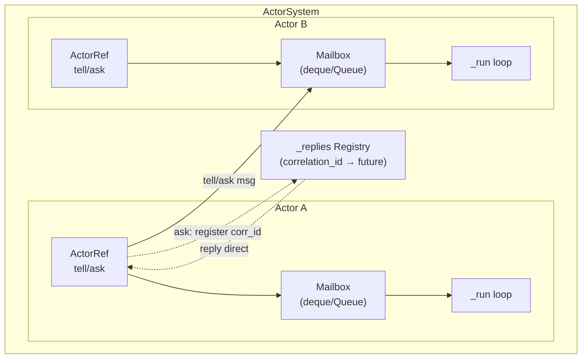
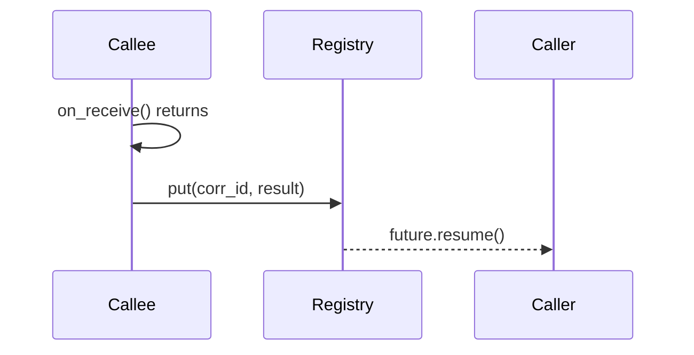

# Mailbox Architecture

## Overview

Mailbox is the message queue for each actor. Every actor has its own mailbox to receive messages from other actors.

## Architecture Diagram



## Two Communication Paths

### Path 1: Actor Messages (via Mailbox)

```mermaid
sequenceDiagram
    participant Caller
    participant Mailbox
    participant Actor
    participant Registry

    Caller->>Mailbox: put_nowait(envelope)
    Caller->>Registry: register(corr_id)
    Actor->>Mailbox: get()
    Actor->>Actor: on_receive()
    Actor->>Registry: put(corr_id, result)
    Registry-->>Caller: future.resume()
```

Both `tell` and `ask` use Mailbox for message delivery.

### Path 2: Reply Messages (via Registry)



Replies bypass Mailbox and go directly through the `_replies` registry.

## Why Replies Don't Use Mailbox?

1. **Point-to-Point**: Reply is for one specific caller, not for actor processing queue
2. **No Blocking**: Replies don't need to be queued, they're delivered directly to waiting coroutine
3. **Performance**: Avoids queue overhead for short-lived response path

## Mailbox Implementations

### 1. MemoryMailbox (Default)

- Backend: `asyncio.Queue`
- Thread-safe
- Supports blocking `await get()`
- Higher overhead (C code, locks, GIL transitions)

```python
system = ActorSystem('app')  # Uses MemoryMailbox by default
```

### 2. FastMailbox

- Backend: `collections.deque`
- NOT thread-safe (safe for single-threaded asyncio)
- Does NOT support blocking `await get()` efficiently
- Lower overhead (pure Python, no locks)

```python
from everything_is_an_actor import ActorSystem, FastMailbox

system = ActorSystem('app', mailbox_cls=FastMailbox)
```

### Performance Comparison

| Mailbox | tell (100K) | ask (50K) |
|---------|-------------|-----------|
| MemoryMailbox | 1.5M/s | 27K/s |
| FastMailbox | 2.4M/s (+58%) | 27K/s (same) |

> Note: `ask` is dominated by async wait overhead (kqueue/epoll), not mailbox implementation.

## Mailbox Selection Guide

| Scenario | Recommended Mailbox |
|----------|-------------------|
| Default, general use | MemoryMailbox |
| High-throughput tell-heavy | FastMailbox |
| Need blocking get() | MemoryMailbox |
| Multi-threaded producers | MemoryMailbox |
| Single-threaded asyncio | FastMailbox |

## Extending Mailbox

Implement the `Mailbox` abstract base class:

```python
class Mailbox(abc.ABC):
    @abc.abstractmethod
    async def put(self, msg: Any) -> bool: ...

    @abc.abstractmethod
    def put_nowait(self, msg: Any) -> bool: ...

    @abc.abstractmethod
    async def get(self) -> Any: ...

    @abc.abstractmethod
    def get_nowait(self) -> Any: ...

    @abc.abstractmethod
    def empty(self) -> bool: ...

    @property
    @abc.abstractmethod
    def full(self) -> bool: ...
```

Example: Redis-backed mailbox for distributed actors.

## Backpressure Policies

Both Mailbox implementations support backpressure:

```python
from everything_is_an_actor.core.mailbox import BACKPRESSURE_BLOCK, BACKPRESSURE_DROP_NEW, BACKPRESSURE_FAIL

mailbox = MemoryMailbox(
    maxsize=100,
    backpressure_policy=BACKPRESSURE_DROP_NEW  # or BLOCK or FAIL
)
```

| Policy | Behavior |
|--------|----------|
| `BLOCK` | Wait until queue has space |
| `DROP_NEW` | Return False if full, don't block |
| `FAIL` | Raise MailboxFullError if full |
