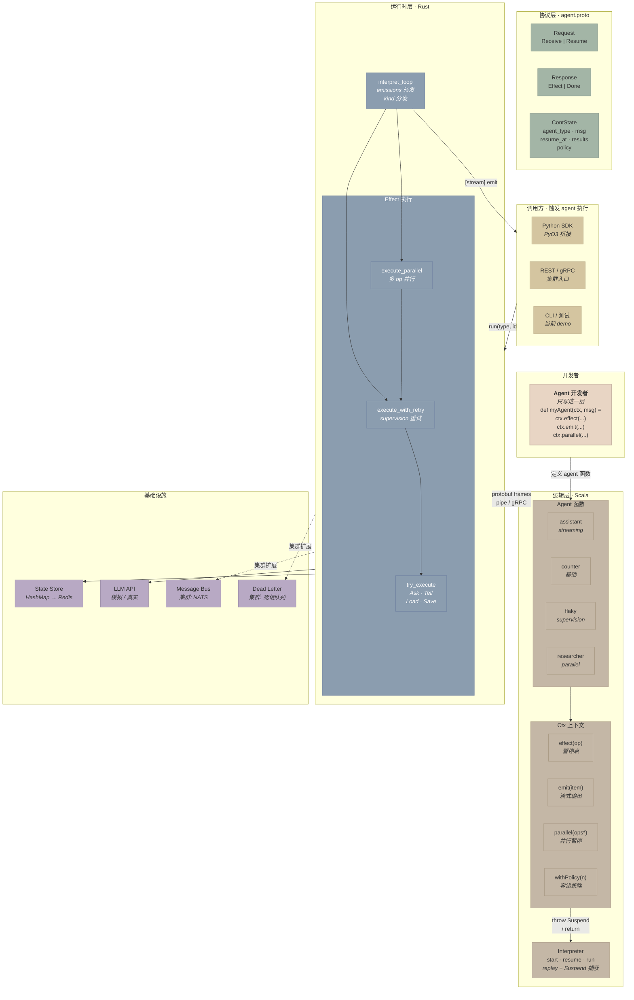
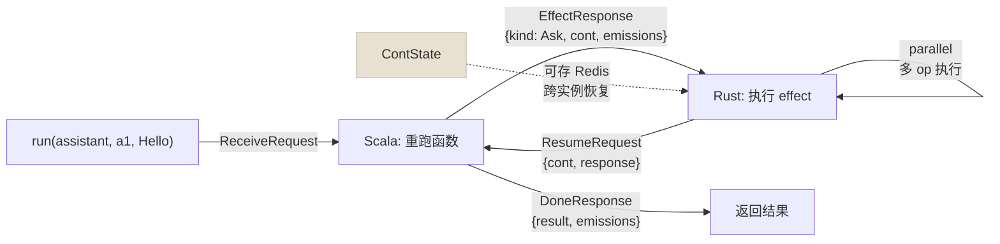
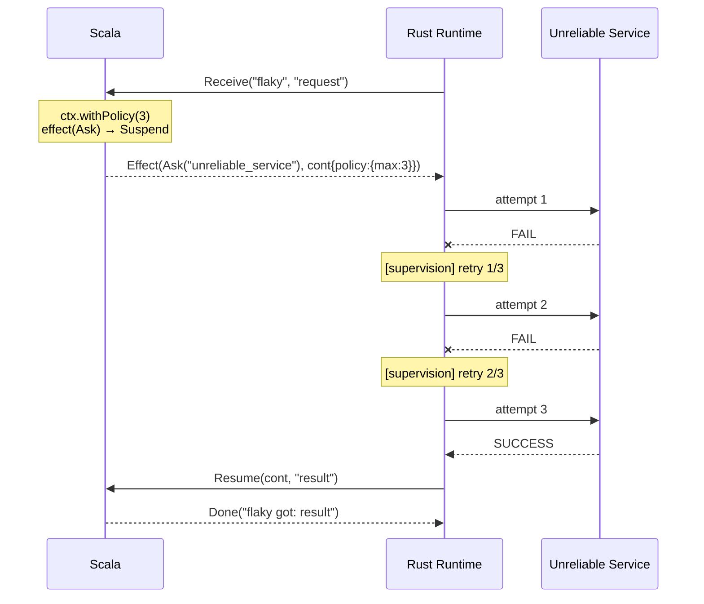
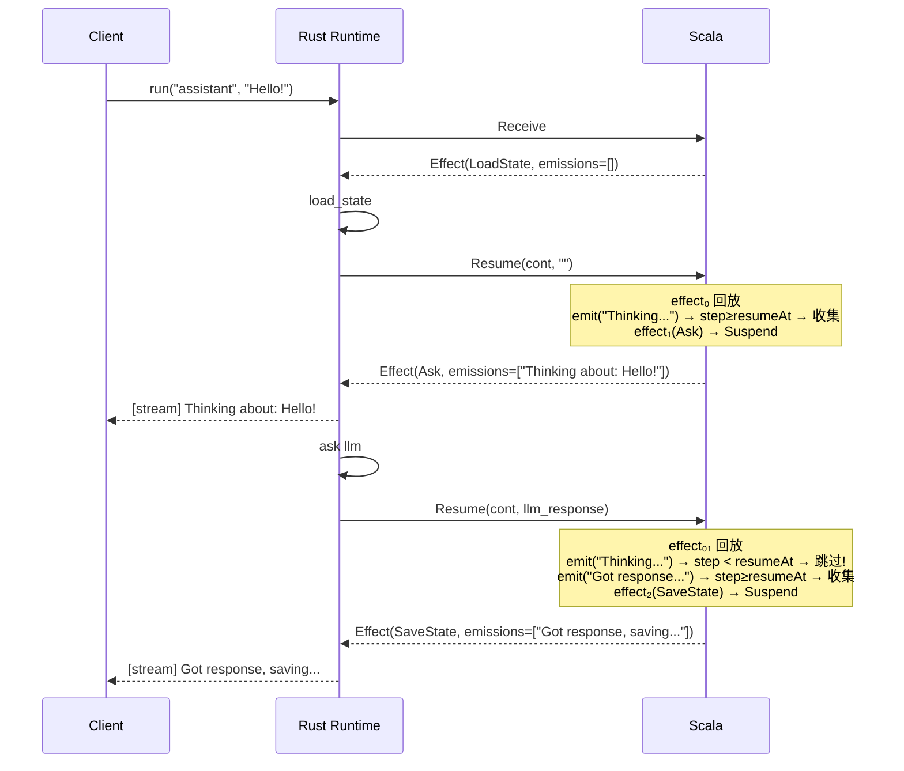
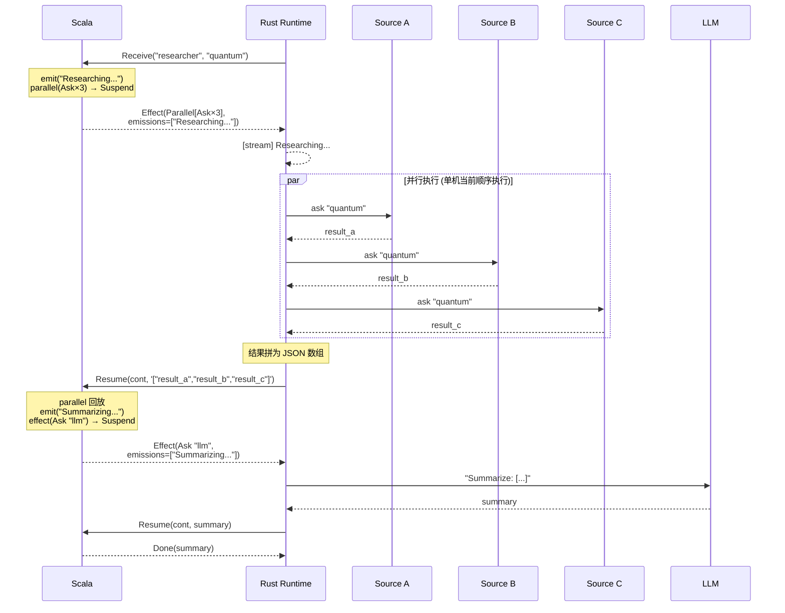
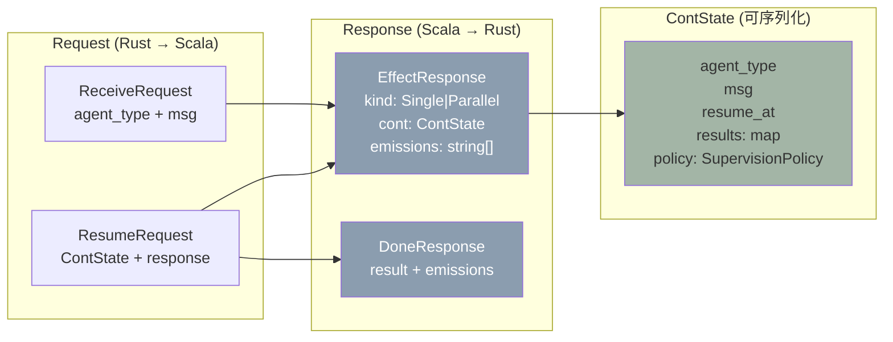

# Rust + Scala Actor Runtime 架构文档

## 一句话

Rust 管资源调度，Scala 管业务逻辑，protobuf 做协议，continuation 可序列化——agent 可以在任意节点暂停/恢复，具备容错（supervision）、流式输出（streaming）、并行执行（parallel）能力。

---

## 架构总览



### 数据流



---

## 系统分层

```
┌──────────────────────────────────────────────────────────────┐
│  Agent 逻辑层 (Scala)                                          │
│  ┌────────────────────────────────────────────────────────┐  │
│  │  Agent 函数: assistant / counter / flaky / researcher    │  │
│  │  ctx.effect(Op)      — 暂停点，等 Rust 执行副作用        │  │
│  │  ctx.emit(item)      — 流式输出，非暂停点               │  │
│  │  ctx.parallel(ops*)  — 并行暂停点                       │  │
│  │  ctx.withPolicy(n)   — 声明 supervision 策略            │  │
│  └──────────────────────┬─────────────────────────────────┘  │
│                         │ throw Suspend / return result        │
│  ┌──────────────────────▼─────────────────────────────────┐  │
│  │  Interpreter: run() / resume()                           │  │
│  │  • Suspend → EffectResponse(kind, cont, emissions)      │  │
│  │  • return → DoneResponse(result, emissions)              │  │
│  └──────────────────────┬─────────────────────────────────┘  │
│                         │ protobuf Response                     │
├─────────────────────────┼────────────────────────────────────┤
│  传输层                   │ length-prefixed protobuf frames     │
│  本地: stdin/stdout pipe │ 集群: gRPC (同一 .proto)             │
├─────────────────────────┼────────────────────────────────────┤
│  Runtime 层 (Rust)       │ protobuf Request                     │
│  ┌──────────────────────▼─────────────────────────────────┐  │
│  │  interpret_loop:                                         │  │
│  │  • emissions → 转发给调用者                              │  │
│  │  • Effect.Single → execute_with_retry (supervision)     │  │
│  │  • Effect.Parallel → execute_parallel (并行执行)         │  │
│  │  • Done → return result                                  │  │
│  └──────────────────────┬─────────────────────────────────┘  │
│                         │                                       │
│  ┌──────────────────────▼─────────────────────────────────┐  │
│  │  副作用执行:                                             │  │
│  │  • LoadState/SaveState → State Store (HashMap / Redis)  │  │
│  │  • Ask → LLM API / 外部服务                              │  │
│  │  • Tell → Message Bus                                    │  │
│  └────────────────────────────────────────────────────────┘  │
└──────────────────────────────────────────────────────────────┘
```

---

## 核心机制: Replay-based Serializable Continuations

### 问题

Agent 函数执行到一半需要等外部结果（LLM 返回、状态加载）。如何暂停并在任意节点恢复？

### 方案

**不存闭包，存数据。每次恢复都从头重跑函数，已完成的 effect 直接回放。**

```scala
def assistant(ctx: Ctx, msg: String): String =
  val history  = ctx.effect(LoadState("chat_history"))  // effect 0
  val prompt   = buildPrompt(history, msg)               // 纯计算
  ctx.emit("Thinking...")                                 // 流式输出（非暂停点）
  val response = ctx.effect(Ask("llm", prompt))          // effect 1
  ctx.emit("Got response, saving...")                     // 流式输出
  ctx.effect(SaveState("chat_history", ...))             // effect 2
  ctx.effect(Tell("audit", ...))                         // effect 3
  response                                                // 返回值
```

`ctx.effect()` 的行为取决于当前 step：

| 调用 | step < resumeAt | step == resumeAt |
|------|----------------|-----------------|
| 行为 | 返回 `saved(step)` (回放) | `throw Suspend(op)` (挂起) |

### Ctx 完整 API

| 方法 | 是否暂停点 | 作用 |
|------|----------|------|
| `ctx.effect(op)` | 是 | 执行单个副作用，返回结果 |
| `ctx.parallel(ops*)` | 是 | 并行执行多个副作用，返回 JSON 数组 |
| `ctx.emit(item)` | 否 | 流式输出，replay 时跳过 |
| `ctx.withPolicy(n)` | 否 | 声明 supervision 策略 |

### ContState 结构

```protobuf
message ContState {
  string agent_type              = 1;  // "assistant"
  string msg                     = 2;  // 原始输入 "Hello!"
  int32 resume_at                = 3;  // 下次从哪个 step 开始执行
  map<int32, string> results     = 4;  // 已完成 effect 的结果
  SupervisionPolicy policy       = 5;  // 容错策略
}
```

纯数据——可以存 Redis、传网络、序列化到磁盘。任何 Scala 实例拿到它都能恢复执行。

---

## Feature 1: Supervision（容错）

### 设计

策略是数据，跟着 ContState 序列化。Scala 声明策略，Rust 执行重试。

```scala
// Scala: agent 声明策略
def flaky(ctx: Ctx, msg: String): String =
  ctx.withPolicy(maxRetries = 3)   // ← 最多重试 3 次
  val result = ctx.effect(Ask("unreliable_service", msg))
  s"flaky got: $result"
```

```rust
// Rust: interpret_loop 读取 policy，执行重试
fn execute_with_retry(&mut self, op, cont) -> String {
    let max = cont.policy.max_retries;
    loop {
        match self.try_execute(op) {
            Ok(result) => return result,
            Err(e) if attempts < max => { attempts += 1; /* retry */ }
            Err(e) => match policy.on_exhaust {
                STOP => return error,
                ESCALATE => /* 集群: 通知上游 supervisor */,
                DEAD_LETTER => /* 集群: 发到死信队列 */,
            }
        }
    }
}
```

### 时序图



### 集群扩展点

| 字段 | 单机行为 | 集群扩展 |
|------|---------|---------|
| `max_retries` | 本地循环重试 | 跨节点重试（带指数退避） |
| `window_seconds` | 未使用 | 时间窗口内的重试计数 |
| `ESCALATE` | 返回错误字符串 | 通知上游 supervisor actor |
| `DEAD_LETTER` | 返回错误字符串 | 发到分布式死信队列 |

---

## Feature 2: Streaming（流式输出）

### 设计

`ctx.emit(item)` 是非暂停点。在 replay 阶段（`step < resumeAt`）静默跳过，只在前向执行时收集。emissions 随下一个 Effect 或 Done 响应一起返回给 Rust。

```scala
// emit 实现
def emit(item: String): Unit =
  if step >= resumeAt then _emissions = _emissions :+ item
```

### 协议

```protobuf
message EffectResponse {
  oneof kind { ... }
  ContState cont           = 2;
  repeated string emissions = 3;  // ← 本轮积攒的流式输出
}

message DoneResponse {
  string result             = 1;
  repeated string emissions = 2;  // ← 最后一轮的输出
}
```

### 时序图



**关键：`emit("Thinking...")` 在第三轮 replay 时被跳过，不会重复发送。**

### 集群扩展点

| 单机 | 集群 |
|------|------|
| `println!("[stream]")` | 回调 trait / channel |
| 批量随 Response 返回 | Server-Streaming RPC 或 WebSocket 侧通道 |

---

## Feature 3: Parallel Effects（并行执行）

### 设计

`ctx.parallel(ops*)` 是一个暂停点，携带多个 op。Rust 侧并行（当前顺序）执行所有 op，结果拼为 JSON 数组返回。

```scala
def researcher(ctx: Ctx, msg: String): String =
  ctx.emit("Researching from 3 sources...")
  val combined = ctx.parallel(         // ← 一次暂停，3 个 op
    Ask("source_a", msg),
    Ask("source_b", msg),
    Ask("source_c", msg)
  )
  // combined = '["result_a","result_b","result_c"]'
  ctx.emit("Summarizing...")
  ctx.effect(Ask("llm", s"Summarize: $combined"))
```

### 协议

```protobuf
message ParallelOps {
  repeated AgentOp ops = 1;
}

message EffectResponse {
  oneof kind {
    AgentOp single       = 1;  // 单个 effect
    ParallelOps parallel = 4;  // 并行 effect
  }
  ...
}
```

### 时序图



### 集群扩展点

| 单机 | 集群 |
|------|------|
| `iter().map()` 顺序执行 | `tokio::spawn` + `join_all` 真并发 |
| 所有 op 本地执行 | 每个 op 路由到不同节点的 `AgentService.Receive` |
| 无超时 | per-op 超时 + 部分失败策略 |

### 与 Actor 树的关系

传统 actor 模型用 `context.spawn()` 创建子 actor 实现并行。集群下子 actor 的生命周期管理复杂（跨节点引用、父子耦合）。`ctx.parallel()` 用 orchestrator 模式替代：

```
Actor 树:       Parent.spawn(Child_A, Child_B, Child_C)
                ↓ 持有引用，管理生命周期

Orchestrator:   ctx.parallel(Ask_A, Ask_B, Ask_C)
                ↓ 纯数据，无引用，ContState 跟踪进度
```

ContState.results 已经记录了哪些 effect 完成、哪些未完成——这就是 orchestrator 的状态。

---

## Agent 一览

| Agent | 特性展示 | 代码 |
|-------|---------|------|
| `counter` | 基础：load → compute → save | 2 个 effect |
| `assistant` | Streaming：emit 穿插在 effect 之间 | 4 个 effect + 2 个 emit |
| `flaky` | Supervision：withPolicy(3) + 不稳定服务 | 1 个 effect + policy |
| `researcher` | Parallel + Streaming：并行查询 + 汇总 | 1 个 parallel + 1 个 effect + 2 个 emit |

---

## 协议设计

### .proto 定义 (单一来源)

```
proto/agent.proto
       │
       ├──→ ScalaPB 生成 Scala case class (agent.pb.agent.*)
       └──→ prost 生成 Rust struct (pb::*)
```

### 消息结构总览



### 帧格式 (本地 pipe)

```
┌──────────┬───────────────────────┐
│ 4 bytes  │ N bytes               │
│ BE u32 N │ protobuf message      │
└──────────┴───────────────────────┘
```

### gRPC (集群)

```protobuf
service AgentService {
  rpc Receive (ReceiveRequest) returns (Response);
  rpc Resume  (ResumeRequest)  returns (Response);
}
```

切换方式：Scala 加 `grpc = true`，Rust 加 tonic。Agent 代码零改动。

---

## 项目结构

```
proto/rust-scala-demo/
├── proto/
│   └── agent.proto              ← 协议定义 (单一来源)
│       ├── AgentOp              (Ask/Tell/LoadState/SaveState)
│       ├── ParallelOps          (repeated AgentOp)
│       ├── SupervisionPolicy    (max_retries, on_exhaust)
│       ├── ContState            (agent_type, msg, resume_at, results, policy)
│       ├── Request/Response     (Receive/Resume ↔ Effect/Done)
│       └── AgentService         (gRPC stub)
├── scala-agent/
│   ├── build.sbt                ← ScalaPB + sbt-assembly
│   └── src/main/scala/agent/
│       └── Core.scala
│           ├── AgentOp          (sealed trait, 5 种: +Parallel)
│           ├── Ctx              (effect, emit, parallel, withPolicy)
│           ├── Suspend          (op, nextStep, results, emissions, policy)
│           ├── Agents           (assistant, counter, flaky, researcher)
│           ├── Interpreter      (start, resume, run)
│           └── Main             (stdin/stdout protobuf loop)
└── rust-runtime/
    ├── Cargo.toml               ← prost + bytes
    ├── build.rs                 ← prost-build
    └── src/main.rs
        ├── ScalaProcess         (spawn JVM, 帧读写)
        ├── Runtime
        │   ├── interpret_loop   (emissions + kind dispatch)
        │   ├── execute_with_retry (supervision)
        │   ├── try_execute      (单个 effect, Result<String, String>)
        │   └── execute_parallel (多个 effect, JSON 数组)
        └── main                 (4 个 agent demo)
```

---

## 运行

```bash
# 编译 Scala
cd scala-agent && sbt assembly

# 编译 + 运行 Rust
cd rust-runtime && cargo run -- ../scala-agent/target/scala-3.3.3/agent-core.jar
```

预期输出：
- `counter`：load → save → done（向后兼容）
- `assistant`：`[stream]` 消息穿插在 effect 之间
- `flaky`：`[supervision] retry 1/3` → `retry 2/3` → 第 3 次成功
- `researcher`：`[stream]` → 3 个 parallel ask → `[stream]` → LLM 汇总

---

## 演进路径

| 阶段 | 传输 | Scala 部署 | 状态存储 | Supervision | Parallel |
|------|------|-----------|---------|-------------|----------|
| **当前** | pipe | JVM 子进程 | HashMap | 本地重试 | 顺序执行 |
| **本地优化** | Unix socket | GraalVM .so | Redis | 本地重试 | tokio 并发 |
| **集群** | gRPC | 独立服务 | Redis Cluster | 跨节点重试 + 熔断 | 分发到多节点 |
| **Serverless** | gRPC + callback | 按需容器 | DynamoDB | 跨实例重试 | Fan-out |

**每个阶段只改 Runtime 层（Rust），Agent 代码（Scala）永远不变。**
